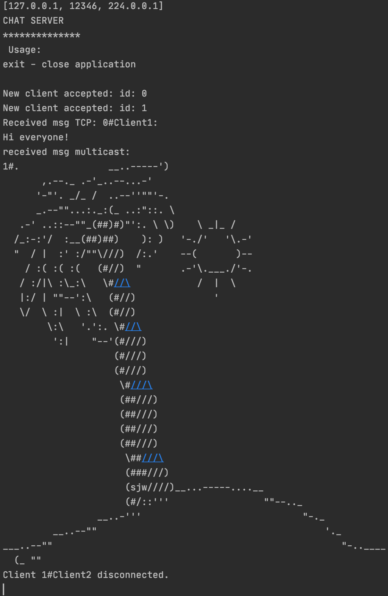
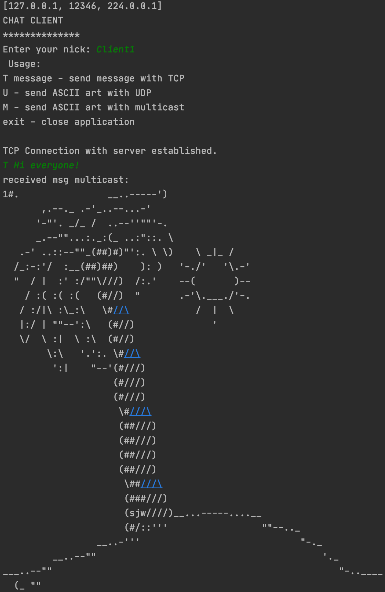

# Socket Chat
Simple chat app to practice Java sockets.

## Server
Accepts new clients, logs all messages sent by the clients and tracks if they are connected.

## Client
Connects with a server, can send a message to all other clients by TCP. Can also send ASCII art by UDP or multicast.

